# Metaphor Detection Using Machine Learning & Semi-Supervised Learning

## Project Overview

This project focuses on detecting metaphorical expressions in Nigerian poetic text using both supervised and semi-supervised machine learning techniques. The system combines Natural Language Processing (NLP), word embeddings, and classification algorithms to identify whether a sentence contains a metaphor.

The project explores how linguistic features such as semantic mappings, conceptual relationships, and contextual word embeddings can improve metaphor classification performance.

A major highlight of this work is the comparison between:

* Traditional supervised learning models
* Semi-supervised learning (SSL) approaches using pseudo-labeling on unlabeled the literary data

The study demonstrates how unlabeled data can help improve metaphor detection performance when labeled data is limited.

---

# Problem Statement

Metaphors are widely used in literature and human communication, but detecting them computationally is challenging because figurative meanings often differ from literal interpretations.

Traditional rule-based approaches struggle to generalize across different writing styles and contexts.

This project aims to:

* Automatically classify metaphorical and non-metaphorical text
* Extract meaningful semantic relationships from text
* Compare supervised learning with semi-supervised learning approaches
* Investigate how unlabeled data can contribute to metaphor detection

---
# System Architectural Design

The architectural design of the proposed metaphor detection system combines both supervised and semi-supervised learning pipelines into a unified framework. The process begins with preprocessing the labeled dataset, which is then divided into training and testing subsets for model development and evaluation. In parallel, a large unlabeled literary dataset undergoes preprocessing and automatic feature augmentation to generate semantic representations useful for metaphor identification. The self-training semi-supervised learning approach then uses an initial trained model to predict pseudo-labels for the unlabeled data. High-confidence predictions are iteratively added back into the labeled training set, allowing the model to continuously improve its learning capability. Finally, the optimized model is evaluated and deployed as the metaphor classifier.

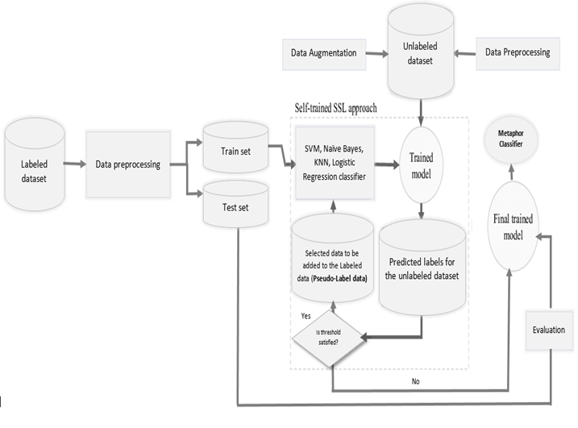

---

# Dataset Description

The project uses:

* **Labeled dataset** → 509 manually annotated literary excerpts
* **Unlabeled dataset** → 14,994 literary excerpts

### Labeled Dataset Features

| Column   | Description                                   |
| -------- | --------------------------------------------- |
| Excerpt  | Literary sentence or phrase                   |
| HPSM     | High-level metaphor semantic mapping          |
| LPSM     | Low-level semantic mapping                    |
| Concepts | Extracted metaphor-related concepts           |
| Label    | Target class (1 = metaphor, 0 = non-metaphor) |


### Class Distribution

* Metaphor - 255
* Non-metaphor - 254
  
The dataset is balanced, which helps reduce model bias during training.

---

# Project Workflow

# Step 1: Import Libraries

The project begins by importing NLP, machine learning, and visualization libraries such as NumPy, Pandas, spaCy, Scikit-learn, Seaborn and Matplotlib which was used for Text preprocessing, Vectorization, Model training, Evaluation and Visualization

---

# Step 2: Load spaCy Language Model

The `en_core_web_lg` spaCy model was downloaded and loaded and this model provides functions like Tokenization, Lemmatization, Part-of-speech tagging, Dependency parsing and 300-dimensional word vectors
These embeddings became the foundation for semantic understanding in the project.

---

# Step 3: Text Preprocessing

A custom preprocessing pipeline was created to tokenize text, Convert words to lowercase, remove punctuation, remove extra whitespaces and lemmatization of words. This preprocessing helps standardize textual data before vectorization.
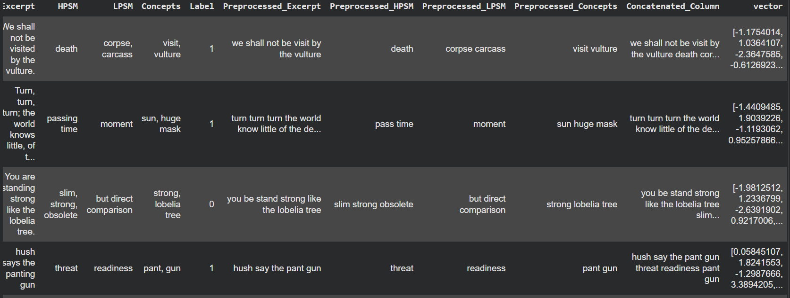

---

# Step 4: Feature Engineering

The following text columns were individually preprocessed:

* Excerpt
* HPSM
* LPSM
* Concepts

After preprocessing, all features were concatenated into a single feature column:

```python
Concatenated_Column = Preprocessed_Excerpt + Preprocessed_HPSM + Preprocessed_LPSM + Preprocessed_Concepts
```

This allowed the model to learn from contextual meaning, semantic mappings and extracted metaphor concepts instead of relying only on raw text.

---

# Step 5: Word Embedding Generation

Each concatenated text was transformed into a numerical vector using spaCy embeddings:

Each sentence became a 300-dimensional dense vector representation an this in turn helped captured the semantic similarity, the contextual relationships and metaphorical meaning from the exercept.

---

# Step 6: Train-Test Split

The labeled dataset was split into 80% training data and 20% testing data to ensure unbiased model evaluation.

---

# Step 7: Supervised Learning Models

Several supervised learning algorithms were trained and evaluated. The models used includes:

* K-Nearest Neighbors (KNN)
* Support Vector Machine (SVM)
* Logistic Regression
* Decision Tree Classifier

---

# Step 8: Model Evaluation

Models were evaluated using accuracy, precision, recall, F1-score and Confusion Matrix. 
## Supervised Learning Results
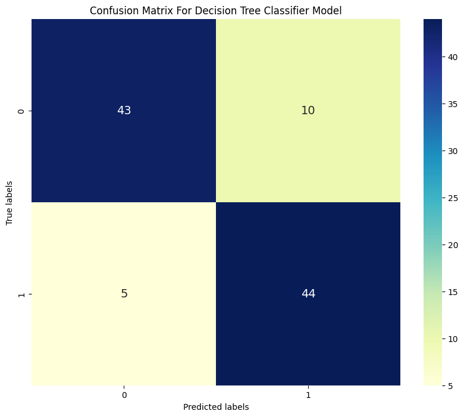

The Decision Tree classifier achieved an accuracy of 85% on the test dataset. From the confusion matrix, the model correctly identified 43 metaphorical instances (True Positives) and 44 non-metaphorical instances (True Negatives). However, the model produced 10 False Positives, where literal expressions were incorrectly classified as metaphors, and 5 False Negatives, where actual metaphors were missed.

This result suggests that while the Decision Tree model was able to capture important decision boundaries within the semantic embedding space, it struggled with generalization compared to the other models. The relatively higher number of False Positives indicates that the model occasionally overfitted to certain semantic patterns, causing it to incorrectly label some literal expressions as metaphorical.

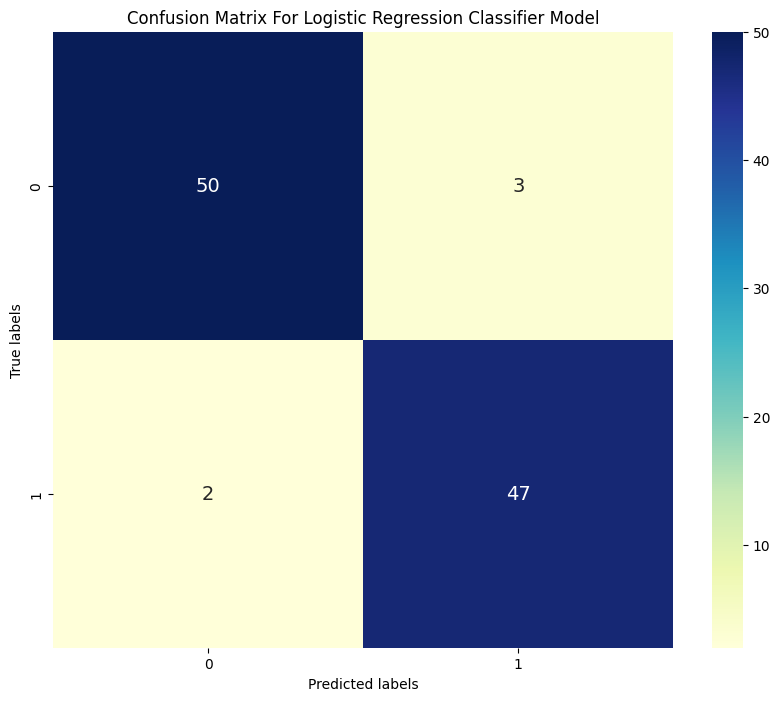

The Logistic Regression classifier demonstrated strong predictive performance with an overall accuracy of 95%. The confusion matrix shows that the model correctly classified 50 metaphorical expressions (True Positives) and 47 non-metaphorical expressions (True Negatives). Only 3 False Positives and 2 False Negatives were recorded.

These results indicate that Logistic Regression was highly effective at separating metaphorical and non-metaphorical language using the generated semantic embeddings. The low number of classification errors demonstrates that the model generalized well and maintained balanced precision and recall across both classes. This performance highlights the suitability of linear models for NLP classification tasks involving dense vector representations.

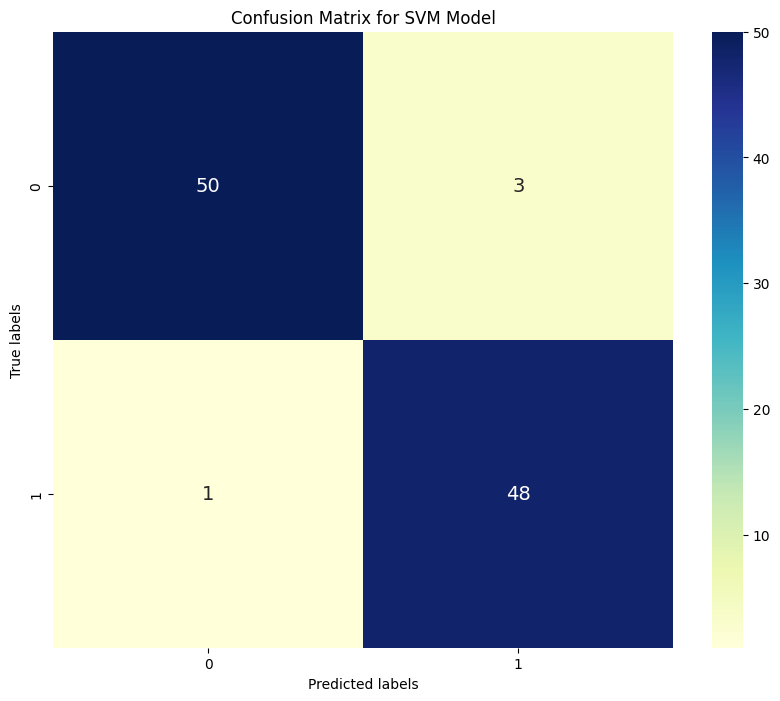

The Support Vector Machine (SVM) classifier achieved the best overall performance among all supervised learning models, reaching an accuracy of 96%. According to the confusion matrix, the model correctly predicted 50 metaphorical instances (True Positives) and 48 non-metaphorical instances (True Negatives). The classifier generated only 3 False Positives and 1 False Negative, indicating exceptionally strong classification capability.

The low error rate demonstrates the effectiveness of SVM in handling high-dimensional semantic embedding data. Its ability to maximize class separation allowed it to distinguish metaphorical language patterns more accurately than the other algorithms. The near-perfect balance between precision and recall confirms that the SVM model provided the most reliable and consistent metaphor detection performance in this study.

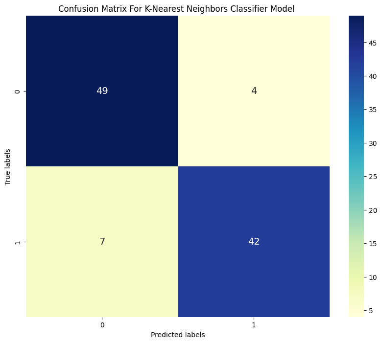

The K-Nearest Neighbors (KNN) classifier achieved an accuracy of 89% on the supervised learning task. The confusion matrix reveals that the model correctly identified 49 metaphorical expressions (True Positives) and 42 non-metaphorical expressions (True Negatives). However, the model recorded 4 False Positives and 7 False Negatives.

The higher number of False Negatives suggests that KNN occasionally failed to detect certain metaphorical expressions, likely due to similarities between metaphorical and literal semantic representations in the vector space. Despite this limitation, the model still performed competitively and demonstrated that distance-based learning methods can effectively classify metaphorical language when supported by high-quality semantic embeddings.

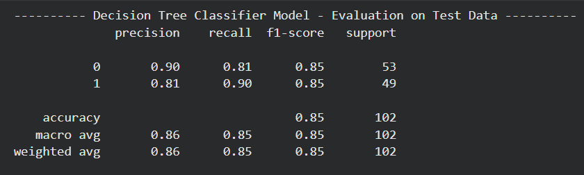
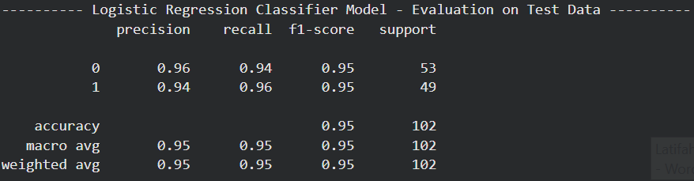
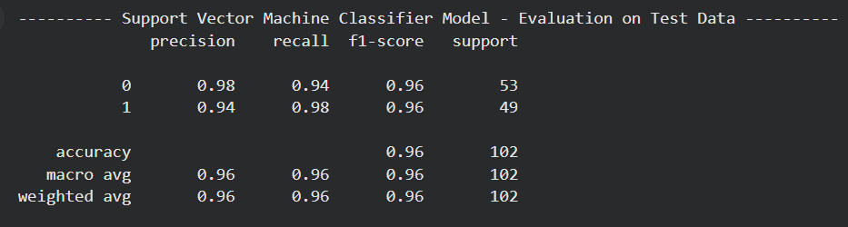
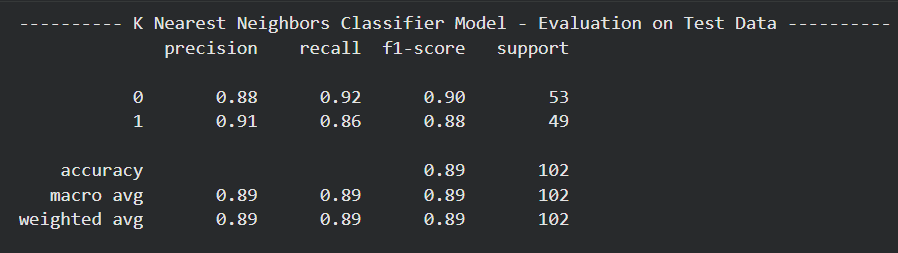

| **Model** | **Precision (Class 0)** | **Recall (Class 0)** | **F1‑Score (Class 0)** | **Precision (Class 1)** | **Recall (Class 1)** | **F1‑Score (Class 1)** | **Accuracy** | **Macro Avg (F1)** | **Weighted Avg (F1)** |
| --- | --- | --- | --- | --- | --- | --- | --- | --- | --- |
| **[Decision Tree](ca://s?q=Decision_Tree_in_supervised_learning)** | 0.90 | 0.81 | 0.85 | 0.81 | 0.90 | 0.85 | 0.85 | 0.85 | 0.85 |
| **[K‑Nearest Neighbors (KNN)](ca://s?q=KNN_in_supervised_learning)** | 0.88 | 0.92 | 0.90 | 0.91 | 0.86 | 0.88 | 0.89 | 0.89 | 0.89 |
| **[Logistic Regression](ca://s?q=Logistic_Regression_in_supervised_learning)** | 0.96 | 0.94 | 0.95 | 0.94 | 0.96 | 0.95 | 0.95 | 0.95 | 0.95 |
| **[Support Vector Machine (SVM)](ca://s?q=SVM_in_supervised_learning)** | 0.98 | 0.94 | 0.96 | 0.94 | 0.98 | 0.96 | 0.96 | 0.96 | 0.96 |

The following table summarizes the performance of all supervised learning models evaluated in this study. SVM and Logistic Regression achieved the strongest overall results, indicating superior generalization and classification capability for metaphor detection tasks.

Hence, **Support Vector Machine (SVM)** is  the Best Performing Model as it achieved the highest performance with:

* 96% accuracy
* a strong precision and recall
* balanced classification performance

This suggests that linear SVMs are highly effective for metaphor classification using semantic embeddings.

---
## Step 9: Processing the Unlabeled Dataset

To extend the learning capability of the system beyond the small labeled dataset, an additional **14,994 unlabeled literary excerpts** were introduced into the pipeline. 


The figure above shows a preview of the raw unlabeled dataset before preprocessing and feature augmentation. At this stage, the dataset mainly contains literary excerpts without semantic mappings or metaphor annotations, making additional NLP-based feature extraction necessary before semi-supervised learning could be applied.

---

# Step 10: Automatic Feature Augmentation for Unlabeled Data

A rule-based and NLP-driven augmentation pipeline was developed to automatically construct semantic features for the unlabeled dataset.

The workflow first searched for explicit comparison markers such as “like” and “as” within each excerpt using regular expression matching. When these markers were detected, placeholder semantic mappings were automatically assigned to the HPSM and LPSM columns to indicate direct comparison relationships. Excerpts without such markers were assigned the placeholder value "Unknown".

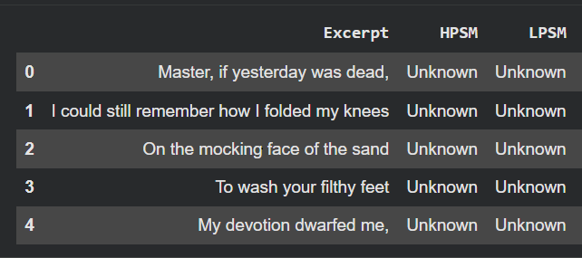

Beyond comparison markers, the system further enriched the unlabeled data by automatically extracting semantic concepts from the excerpts using spaCy’s linguistic processing capabilities. Several important linguistic relationship structures were identified, including:

Noun–Noun pairs
Adjective–Noun pairs
Adverb–Adjective pairs

These linguistic combinations are highly relevant in metaphorical language because metaphors often connect semantically distant concepts together.

Examples include:

quiver, tree
panting gun
water, voice

To identify potential metaphorical relationships, cosine similarity was calculated between the embedding vectors of extracted word pairs.

```python
cosine_similarity(vec1, vec2)
```

This step measured the semantic distance between paired words:

***Lower cosine similarity*** → higher semantic dissimilarity
***Higher semantic dissimilarity*** → stronger metaphorical potential

Since metaphorical expressions often combine concepts from unrelated semantic domains, semantically distant pairs became strong candidate features for metaphor detection. The system therefore selected highly dissimilar word pairs and used them to automatically augment the Concepts column of the unlabeled dataset.

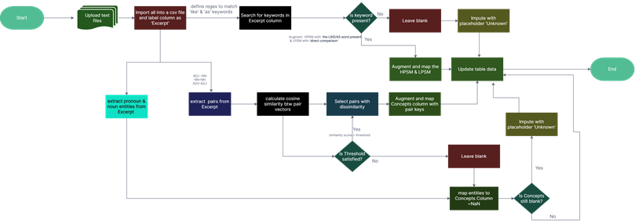

The figure above illustrates the complete feature extraction and augmentation workflow applied to the unlabeled dataset. Semantic relationships were extracted from literary excerpts using dependency parsing and linguistic pair detection. Cosine similarity analysis was then applied to identify semantically distant word pairs, which served as strong indicators of metaphorical language. The extracted concepts and generated semantic mappings were subsequently used to enrich the unlabeled dataset for semi-supervised learning.        

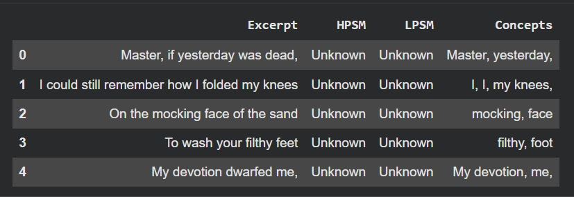

The final augmented dataset above shows how semantic mappings and automatically extracted concepts were integrated into previously unlabeled literary excerpts. These engineered features significantly improved the quality of the unlabeled dataset and provided meaningful semantic representations for the next preprocessing and vectorization stage of the pipeline.

---

# Step 13: Preprocessing the Augmented Unlabeled Dataset

After augmentation, the unlabeled dataset underwent the same preprocessing pipeline applied to the labeled dataset which included tokenization, lemmatization, lowercasing, removal punctuation and whitespace. This ensured consistency between both datasets before vector generation and model training.

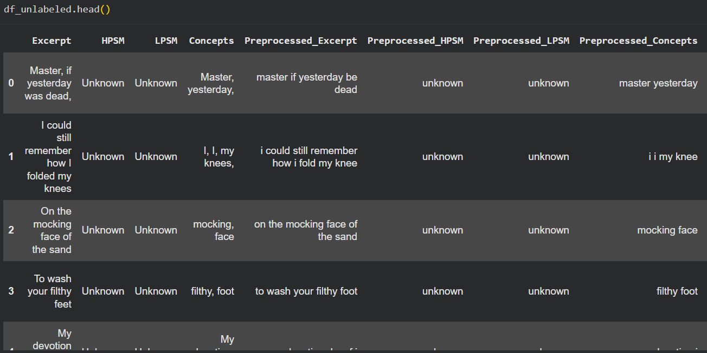

TThe figure above shows the unlabeled dataset after semantic augmentation and preprocessing. Individual feature columns such as Excerpt, HPSM, LPSM, and Concepts were first cleaned and standardized.

During model development, directly using multiple independently vectorized feature columns introduced array conversion and dimensional consistency challenges. To address this, all preprocessed semantic features were merged into a single unified text representation called Concatenated_Column. This combined column contained the preprocessed excerpt together with the generated HPSM, LPSM, and Concepts information.

The unified textual representation was then transformed into dense vector embeddings using spaCy’s pretrained language model:

```python
df_unlabeled['vector'] = df_unlabeled['Concatenated_Column'].apply(lambda x: nlp(x).vector)
```
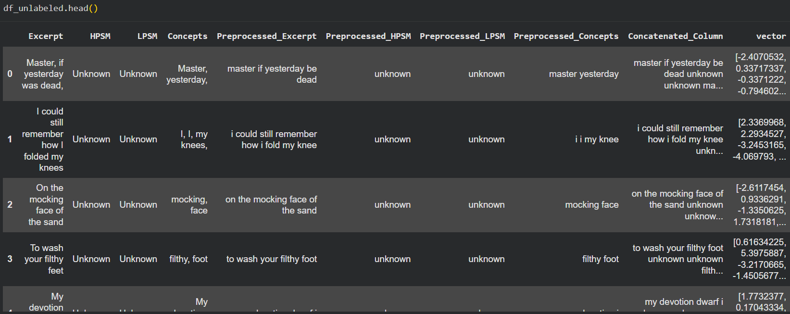

This approach produced a single fixed-length semantic vector representation for each literary excerpt, making the dataset compatible with the machine learning classifiers used in the semi-supervised learning pipeline.

---

# Step 14: Semi-Supervised Learning (SSL)

Once the unlabeled dataset had been enriched and vectorized, semi-supervised learning was implemented using a pseudo-labeling strategy.

Unlike supervised learning, SSL does not rely entirely on manually labeled data. Instead, the model gradually learns from unlabeled samples by assigning predicted labels with high confidence.

## SSL Workflow

### Phase 1: Initial Training

A small subset of labeled training data was used to train an initial classifier.

### Phase 2: Pseudo-Label Prediction

The trained model predicted labels for the unlabeled dataset.

### Phase 3: Confidence Filtering

Only predictions above a confidence threshold were selected.

For example:

* Logistic Regression → probability threshold
* SVM → decision function threshold

### Phase 4: Dataset Expansion

High-confidence pseudo-labeled samples were added back into the labeled training set.

### Phase 5: Iterative Retraining

The model was retrained repeatedly using the expanded dataset until no additional confident predictions remained.

This iterative learning process allowed the model to leverage thousands of unlabeled literary excerpts without requiring manual annotation.

---

# Semi-Supervised Learning Results


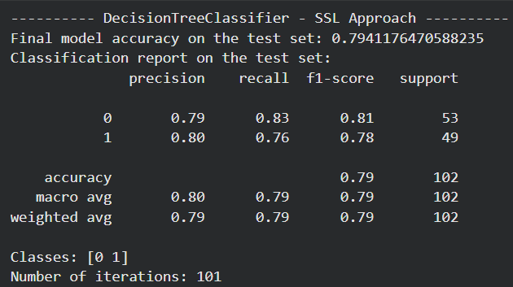
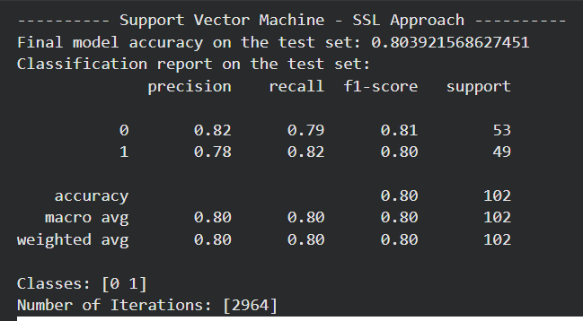
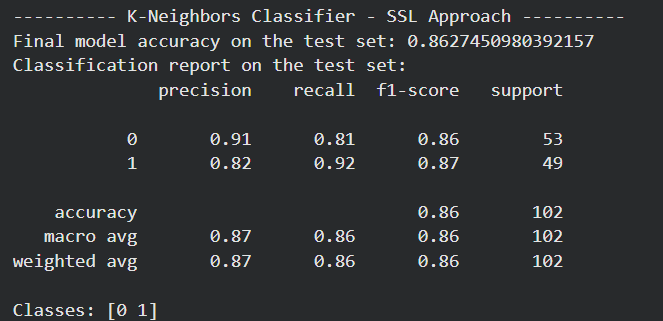


| Model               | SSL Accuracy |
| ------------------- | ------------ |
| Logistic Regression | 93%          |
| KNN                 | 86%          |
| SVM                 | 80%          |
| Decision Tree       | 79%          |

---

# Interpretation of SSL Results

The SSL experiments demonstrated that unlabeled literary data can significantly improve metaphor detection performance when properly augmented with semantic features.

Among all SSL models:

* **Logistic Regression achieved the best SSL performance (93%)**
* KNN maintained stable performance
* SVM performance decreased compared to fully supervised learning
* Decision Tree struggled with generalization during iterative pseudo-labeling

These results suggest that linear probabilistic models adapt more effectively to pseudo-labeled semantic embeddings than rigid decision-boundary models.

---

# Key Findings

## 1. Supervised Learning Achieved the Highest Overall Accuracy

The supervised SVM model achieved the best performance overall with:

* 96% accuracy
* strong precision and recall balance
* minimal classification error

This highlights the importance of high-quality labeled data in metaphor detection tasks.

---

## 2. Semi-Supervised Learning Still Performed Strongly

Despite relying heavily on unlabeled data, SSL Logistic Regression achieved:

* 93% accuracy

This demonstrates that pseudo-labeling combined with semantic feature augmentation can effectively reduce dependence on manual annotation.

---

## 3. Semantic Embeddings Were Highly Effective

The pretrained spaCy embeddings successfully captured:

* contextual semantics
* figurative relationships
* semantic dissimilarity patterns

This enabled strong classification performance without requiring transformer-based deep learning models.

---

# Challenges Encountered

## Logistic Regression Convergence Warnings

During SSL training, Logistic Regression occasionally produced convergence warnings because of:

* increasing training size
* high-dimensional embeddings
* iterative retraining

Possible solutions include:

* feature scaling
* increasing `max_iter`
* dimensionality reduction techniques such as PCA

---

## Complexity of Figurative Language

Metaphorical expressions are highly context-dependent and often ambiguous. Some literary excerpts contained subtle figurative patterns that were difficult to distinguish from literal language, particularly when semantic similarities between paired concepts were weak.

---

# Future Improvements

Future enhancements could include:

* Transformer architectures (BERT, RoBERTa)
* Contextual embedding models
* Attention-based NLP systems
* Larger annotated metaphor corpora
* Advanced semantic similarity learning
* Hybrid deep learning and linguistic rule systems

---

# Conclusion

This project demonstrates how Natural Language Processing and machine learning techniques can effectively detect metaphorical language in literary text.

The integration of:

* semantic embeddings
* linguistic feature engineering
* concept augmentation
* semantic similarity analysis
* semi-supervised learning

enabled the development of highly accurate metaphor detection models.

The study further highlights how unlabeled literary data can be transformed into valuable training information through NLP-driven augmentation techniques, reducing dependence on expensive manual annotation processes.


