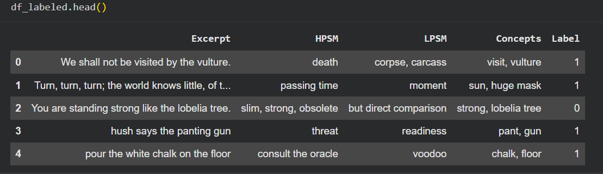

# Metaphor Detection Using Machine Learning & Semi-Supervised Learning

## Project Overview

This project focuses on detecting metaphorical expressions in Nigerian poetic text using both supervised and semi-supervised machine learning techniques. The system combines Natural Language Processing (NLP), word embeddings, and classification algorithms to identify whether a sentence contains a metaphor.

The project explores how linguistic features such as semantic mappings, conceptual relationships, and contextual word embeddings can improve metaphor classification performance.

A major highlight of this work is the comparison between:

* Traditional supervised learning models
* Semi-supervised learning (SSL) approaches using pseudo-labeling on unlabeled the literary data

The study demonstrates how unlabeled data can help improve metaphor detection performance when labeled data is limited.

---

# Problem Statement

Metaphors are widely used in literature and human communication, but detecting them computationally is challenging because figurative meanings often differ from literal interpretations.

Traditional rule-based approaches struggle to generalize across different writing styles and contexts.

This project aims to:

* Automatically classify metaphorical and non-metaphorical text
* Extract meaningful semantic relationships from text
* Compare supervised learning with semi-supervised learning approaches
* Investigate how unlabeled data can contribute to metaphor detection

---

# Dataset Description

The project uses:

* **Labeled dataset** → 509 manually annotated literary excerpts
* **Unlabeled dataset** → 14,994 literary excerpts

### Labeled Dataset Features

| Column   | Description                                   |
| -------- | --------------------------------------------- |
| Excerpt  | Literary sentence or phrase                   |
| HPSM     | High-level metaphor semantic mapping          |
| LPSM     | Low-level semantic mapping                    |
| Concepts | Extracted metaphor-related concepts           |
| Label    | Target class (1 = metaphor, 0 = non-metaphor) |


### Class Distribution

* Metaphor - 255
* Non-metaphor - 254

The dataset is balanced, which helps reduce model bias during training.

---

# Project Workflow

# Step 1: mport Libraries

The project begins by importing NLP, machine learning, and visualization libraries such as:

* NumPy
* Pandas
* spaCy
* Scikit-learn
* Seaborn
* Matplotlib

These libraries were used for:

* Text preprocessing
* Vectorization
* Model training
* Evaluation
* Visualization

---

# Step 2: Load spaCy Language Model

The `en_core_web_lg` spaCy model was downloaded and loaded.

This model provides:

* Tokenization
* Lemmatization
* Part-of-speech tagging
* Dependency parsing
* 300-dimensional word vectors

These embeddings became the foundation for semantic understanding in the project.

---

# Step 3: Text Preprocessing

A custom preprocessing pipeline was created to:

* Tokenize text
* Convert words to lowercase
* Remove punctuation
* Remove extra whitespaces
* Lemmatize words

Example:

| Original Text                             | Preprocessed Text                      |
| ----------------------------------------- | -------------------------------------- |
| "We shall not be visited by the vulture." | "we shall not be visit by the vulture" |

This preprocessing helps standardize textual data before vectorization.

---

# Step 4: Feature Engineering

The following text columns were individually preprocessed:

* Excerpt
* HPSM
* LPSM
* Concepts

After preprocessing, all features were concatenated into a single feature column:

```python
Concatenated_Column = Preprocessed_Excerpt + Preprocessed_HPSM + Preprocessed_LPSM + Preprocessed_Concepts
```

This allowed the model to learn from:

* contextual meaning
* semantic mappings
* extracted metaphor concepts

instead of relying only on raw text.

---

# Step 5: Word Embedding Generation

Each concatenated text was transformed into a numerical vector using spaCy embeddings:

Each sentence became a 300-dimensional dense vector representation an this in turn helped captured the:

* semantic similarity
* contextual relationships
* metaphorical meaning

---

# Step 6: Train-Test Split

The labeled dataset was split into 80% training data and 20% testing data to ensure unbiased model evaluation.

---

# Step 7: Supervised Learning Models

Several supervised learning algorithms were trained and evaluated.

## Models Used

* K-Nearest Neighbors (KNN)
* Support Vector Machine (SVM)
* Logistic Regression
* Decision Tree Classifier

---

# Step 8: Model Evaluation

Models were evaluated using:

* Accuracy
* Precision
* Recall
* F1-score
* Confusion Matrix

---

# Supervised Learning Results

| Model                        | Accuracy |
| ---------------------------- | -------- |
| Support Vector Machine (SVM) | 96%      |
| Logistic Regression          | 95%      |
| K-Nearest Neighbors          | 89%      |
| Decision Tree                | 85%      |

## Best Performing Model

The **Support Vector Machine (SVM)** achieved the highest performance with:

* 96% accuracy
* strong precision and recall
* balanced classification performance

This suggests that linear SVMs are highly effective for metaphor classification using semantic embeddings.

---

# Step 9: Unlabeled Data Processing

The unlabeled dataset contained 14,994 literary excerpts. To make the data useful for SSL, HPSM and LPSM markers were automatically generated. Concepts were extracted using:
  * dependency parsing
  * noun phrase extraction
  * metaphorical pair detection

---

# Step 10: Concept Extraction Strategy

Several NLP strategies were used to identify metaphorical relationships:

## Extracted Pair Types

* Noun–Noun pairs
* Adjective–Noun pairs
* Adverb–Adjective pairs

These linguistic combinations help capture figurative semantic relationships.

---

# Step 11: Semantic Dissimilarity Detection

Cosine similarity was used to identify semantically distant word pairs.

Low similarity scores often indicate metaphorical relationships because metaphorical terms tend to connect unrelated semantic domains. Hence, this became a key feature engineering step in the project.

---

# Step 12: Semi-Supervised Learning (SSL)

The project implemented pseudo-labeling for SSL.

## SSL Process

1. Train initial model on small labeled subset
2. Predict labels for unlabeled data
3. Select high-confidence predictions
4. Add confident predictions to training set
5. Retrain model iteratively

This process allows the model to learn from unlabeled literary data.

---

# Semi-Supervised Learning Results

| Model               | SSL Accuracy |
| ------------------- | ------------ |
| Logistic Regression | 93%          |
| KNN                 | 86%          |
| SVM                 | 80%          |
| Decision Tree       | 79%          |

---

# Key Findings

## 1. Supervised Learning Outperformed SSL

The fully supervised SVM model achieved the best overall performance.

Reason:

* High-quality labeled data
* Balanced dataset
* Strong semantic embeddings

---

## 2. SSL Still Performed Strongly

The SSL Logistic Regression model achieved:

* 93% accuracy

This demonstrates that unlabeled literary data can significantly improve performance when labeled data is limited.

---

## 3. Semantic Embeddings Were Highly Effective

spaCy’s pretrained embeddings successfully captured:

* contextual meaning
* semantic relationships
* metaphorical patterns

without requiring deep neural networks.

---

# Challenges Encountered

## Convergence Warnings

Logistic Regression produced convergence warnings during SSL training.

Possible improvements would include feature scaling, increasing `max_iter` or dimensionality reduction

---

## Metaphor Complexity

Metaphorical language is highly context-dependent, making some expressions difficult to classify accurately.

---

# Future Improvements

Possible future enhancements include:

* Transformer models (BERT, RoBERTa)
* Contextual embeddings
* Attention mechanisms
* Deep learning architectures
* Larger annotated datasets
* Advanced semantic similarity techniques

---
# Example Results

## Supervised SVM Performance

```text
Accuracy: 96%
Precision: 96%
Recall: 96%
F1-score: 96%
```

## SSL Logistic Regression Performance

```text
Accuracy: 93%
Precision: 93%
Recall: 93%
F1-score: 93%
```

---

# Conclusion

This project demonstrates that machine learning and NLP techniques can effectively detect metaphorical language in literary text.

The combination of:

* semantic embeddings
* feature engineering
* linguistic relationship extraction
* semi-supervised learning

resulted in highly accurate metaphor classification models.

The study also highlights the importance of unlabeled data in NLP tasks where annotated datasets are limited.

---

# Author
Latifah Usaini Bashir


